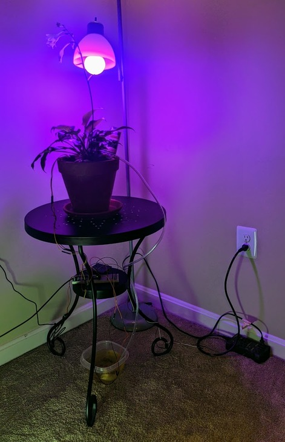
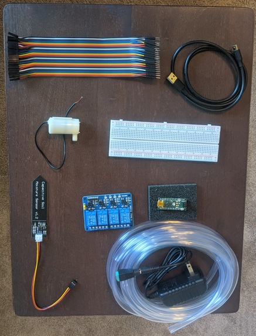
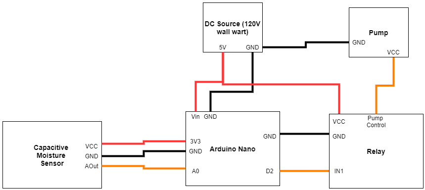
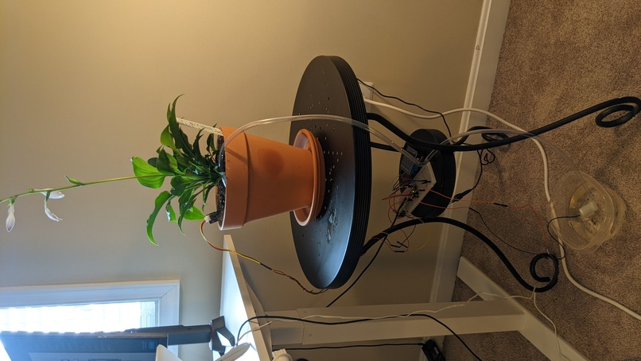

# Embedded Plant Watering and Lighting
Monitor moisture levels in soil and automatically water a house plant, turn on lighting system depending on the time of day. 

## **Abstract**

I wanted to spruce up my room and knew that I wanted techno-natural themed decorations. As I was brain-storming embedded systems ideas, it came to me that an automated plant watering and lighting system would be the ideal addition to my minimalist room. This readme file details the materials and methods I used to complete my project and how I turned it from an idea into a reality. 

## Results

The video at this [YouTube link](https://youtu.be/FvzQ_0edmb4) shows the completed irrigation system automatically controlling the watering system as the moisture sensor is removed from the soil. This [YouTube video](https://youtu.be/sns0XTtDSVc) shows the light being turned on and off by the microcontroller. These videos are also available in this repository under the media directory.  The picture below shows the completed system. 

## **Methods**

### Watering

I chose the [WayinTop DIY irrigation kit](https://smile.amazon.com/dp/B07TMVNTDK?psc=1&ref=ppx_yo2_dt_b_product_details) as my irrigation hardware package since it came with the pumps, piping, capacitive sensors, and a relay board. This kit didn't include the microcontroller or power supply but did come with Arduino code that reads from the capacitive sensors and signals the relay to turn on the pump which I used as a starting point for my code. The seller also provided me with wiring instructions detailing the connections between each submodule of the irrigation system part of the project. 

After a bit of digging I decided to use the [Arduino Nano](https://store.arduino.cc/usa/arduino-nano) because of it's simplicity as well as its ability to fit snuggly onto my breadboard. 

My full parts list (for lighting and irrigation) can be found on my [costs spreadsheet](./Costs.xlsx). The entire project cost $169.50 (includes the cost of the plant). I did also need to use two plastic Tupperware containers to demo the pump's action as well as a few towels to clean up some spilled water. A knife was used to cut the pump tubing and it also doubled as a screwdriver for securing the relay terminals and 5V output terminals. 

Although the DC 5V source was not included in the irrigation kit, I thankfully came across an [AC -> DC 5V converter](https://www.amazon.com/gp/product/B07GL9YB3Z/ref=ox_sc_act_title_1?smid=A2DYIB4IPW7T3M&psc=1) which includes a +/- screw-down terminator allowing me to use my breadboard wires to power the project with ease. The following pictures shows the major components of the irrigation system. 

The following wiring diagram shows how the different parts of the irrigation subsystem are interconnected. Note that this wiring diagram was inspired by the guide provided by the irrigation kit seller but is my own original work. 

The original code for the project was also provided by the seller of the irrigation kit. However, I have reworked the code and calibrated it to nurture an *Invicible Plaintain Lily* and have added more features such as lighting control and changed the variable names to be more easily read and debugged. Find the code [here](./driver/driver.ino). Here's a photo of the plant with the irrigation system installed. 

I had to calibrate the capacitive sensor to ensure that the plant did not experience over-watering which can result in root-rot. I settled on a capacitive sensor value of 550 and placed the sensor relatively close to the irrigation hose. This made sure that the plant only received small amounts of water. Since my room is cool evapotranspiration is not drawing much water out of the plant. 

### Lighting

Because I decided to grow my plant indoors, it became crucial to add a lighting system that would allow for light from the correct portion of the spectrum to fall on the plant. I considered using a dedicated LED lighting system with dimmers and timers but quickly realized that none were available that would allow for microcontroller based programming. The main issue being that if those systems were to be plugged into a microcontroller based power outlet, turning the system on would only turn on the dimmer controller and not necessarily the light. Since most of these systems use their own microcontroller which defaults to off when the system is first attached to 120V power.  

So I decided to take the approach of turning on and off a lamp in my room using a [microcontroller regulated 120V power outlet](https://smile.amazon.com/gp/product/B00WV7GMA2/ref=ppx_yo_dt_b_asin_title_o00_s00?ie=UTF8&psc=1). The lamp contained a dedicated [plant lighting bulb](https://smile.amazon.com/gp/product/B07TT8H6F8/ref=ppx_yo_dt_b_asin_title_o00_s00?ie=UTF8&psc=1). The lighting was controlled using the Arduino Nano to provide 3 hours of lighting everyday (per the instructions on the plant label.) 

The [Arduino Time Library](https://playground.arduino.cc/Code/Time/) provided the functionality needed to control the timing for the plant lighting. Timing control was implemented by keeping track of the seconds passed since the program had begun. This value was used in a logical operation with the modulo operator to determine whether or not the current second was within the first three hours of the 24 hour cycle.

`thisMoment = now();`

`if ((thisMoment % secondsInADay) < secondsInThreeHours){
  //turn on the light
  Serial.print("Time for light! \n");
  digitalWrite(lightControl, LOW);}
else {
  Serial.print("Lights out! \n");
  digitalWrite(lightControl, HIGH);
}`

