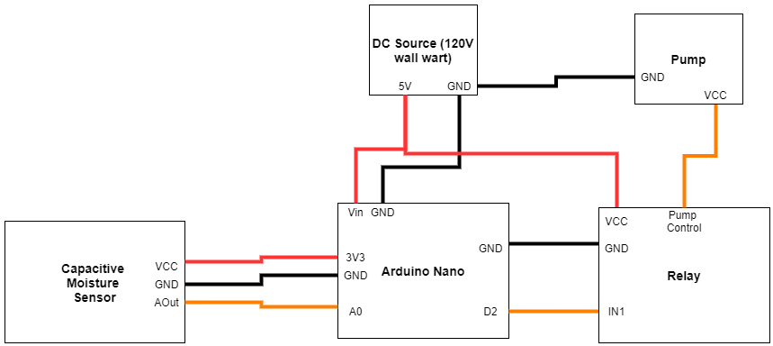

# Embedded Plant Watering and Lighting
Monitor moisture levels in soil and automatically water a house plant, turn on lighting system depending on the time of day. 

## **Abstract**

I wanted to spruce up my room and knew that I want techno-natural themed decorations. As I brain-storming embedded systems ideas, it came to me that an automated plant watering and lighting system would be the ideal addition to my minimalist room. This readme file details the materials and methods I used to complete my project and how I turned it from an idea into a reality. 

## **Methods**

I chose the [WayinTop DIY irrigation kit](https://smile.amazon.com/dp/B07TMVNTDK?psc=1&ref=ppx_yo2_dt_b_product_details) as my irrigation hardware package since it came with the pumps, piping, capacitive sensors, and relay board. This kit didn't include the microcontroller or power supply but did come with Arduino code that reads from the capacitive sensors and signals the relay to turn on the pump which I used as a starting point for my code. The seller also provided me with wiring instructions detailing the connections between each submodule of the irrigation system part of the project. 

After a bit of digging I decided to use the [Arduino Nano](https://store.arduino.cc/usa/arduino-nano) because of it's simplicity as well as its ability to fit snuggly onto my breadboard. 

My full parts list (for lighting and irrigation) can be found on my [costs spreadsheet](./Costs.xlsx). The entire project cost only $81.61. I did also need to use two plastic Tupperware containers to demo the pump's action as well as a few towels to clean up some spilled water. A knife was used to cut the pump tubing and it also doubled as a screwdriver for securing the relay terminals and 5V output terminals. 

Although the DC 5V source was not included in the irrigation kit, I thankfully came across an [AC -> DC 5V converter](https://www.amazon.com/gp/product/B07GL9YB3Z/ref=ox_sc_act_title_1?smid=A2DYIB4IPW7T3M&psc=1) which includes a +/- screw-down terminator allowing me to use my breadboard wires to power the project with ease. 

The following wiring diagram shows how the different parts of the irrigation subsystem are interconnected. Note that this wiring diagram was inspired by the guide provided by the irrigation kit seller but is my own original work. 

The original code for the project was also provided by the seller of the irrigation kit. However, I have reworked the code and calibrated it to nurture an *Invicible Plaintain Lily* and have added more features such as lighting control and changed the variable names to be more easily read and debugged. Find the code [here](./driver/driver.ino)

### Troubleshooting

After the pump demo was completed water was spilled on the components. Power was removed and the components were allowed to dry for about 1.5 hours and after that time they were reassembled. However, upon reassembly of the system, the system did not work. This required some troubleshooting. So I purchased a logic analyzer and multimeter to check signal levels on the board (see cost spreadsheet for product details). 

It was found that the capacitive sensor still worked and interacted with the Arduino serial monitor just fine. But when the soil level was dry enough to enable the pump, nothing happened. So I began checking signal levels using the logic analyzer. I started with 
